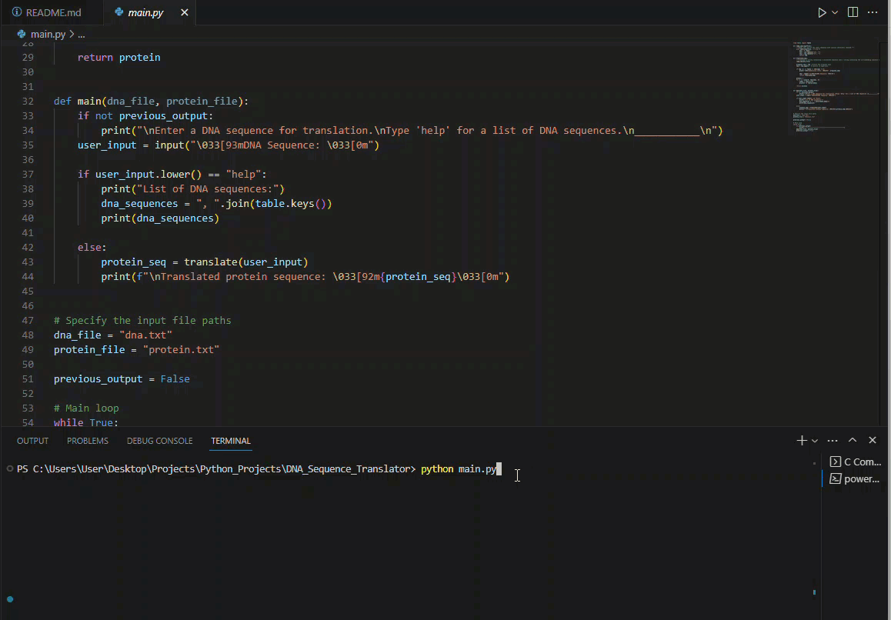

# DNA Sequence Translator

This is a Python program that translates a DNA sequence into a corresponding sequence of amino acids. It uses a table dictionary to map nucleotide triplets (codons) to their respective amino acids. The program reads a DNA sequence from a file, removes any special characters, and translates it into a protein sequence using the table dictionary.

## Demo



## Features

- Translation of DNA sequence into protein sequence
- Handling of invalid codons and input validation
- List available DNA sequences
- Continuous translation loop until user quits


## Commands
- `help` - Prints a list of avalible dna sequences
- `quit` - control + c to quit


## Usage

#
1. Clone the repository:

   ```bash
   git clone https://github.com/iAlex0/dna-sequence-translator.git

#
2. Run server:

```bash
python main.py
```


## License
MIT © iAlex0
